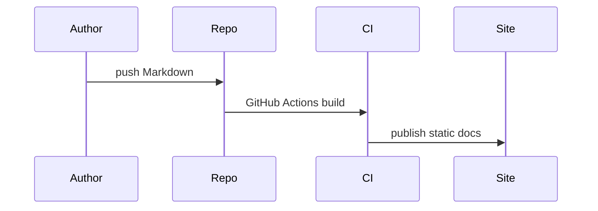

# Architektura

## Obsahové vrstvy

- `docs/cs/` a `docs/en/` pro jazykový obsah
- `docs/blog/` pro články a release notes
- `docs/api/` pro OpenAPI specifikaci
- `docs/versions/` pro starší vydání
- `docs/assets/` pro JS, CSS a obrázky

## Datový tok

