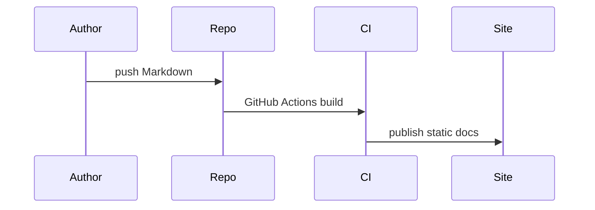

# Architektura

## Obsahové vrstvy

- `docs/cs/` a `docs/en/` pro jazykové mutace
- `docs/blog/` pro články
- `docs/api/` pro OpenAPI
- `docs/versions/` pro verze
- `docs/assets/` pro JS, CSS a obrázky

## Tok buildu

