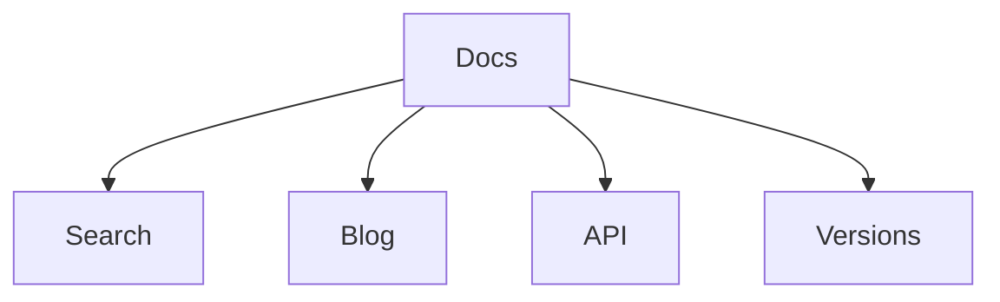

# VCCSD Docs Pro

Produkční dokumentace s vyhledáváním, verzemi, blogem, API referencí a dvěma jazyky.

## Co je připravené

- fulltextové vyhledávání
- CZ / EN struktura
- automatické menu
- editace přes GitHub
- command palette `Ctrl+K`
- lazy loading
- skeleton loading
- blog
- versioned docs
- Mermaid
- OpenAPI

## Rychlý vstup

```bash
mkdocs serve
```

## Ukázka Mermaid


