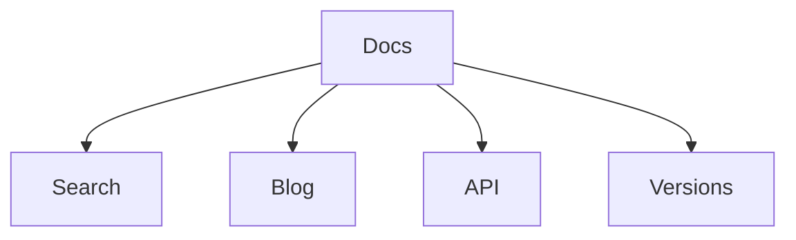

# VCCSD Docs Pro

Tento repozitář je připravený jako kompletní základ pro produkční dokumentaci.

## Co je zde hotové

- fulltextové vyhledávání
- CZ / EN mutace
- automatický menu index
- editace přes GitHub
- command palette `Ctrl+K`
- skeleton loading
- lazy loading
- blog
- verze dokumentace
- Mermaid
- OpenAPI
- generovaný index Markdown souborů

## Vstupní body

- [Česká verze](cs/)
- [English version](en/)
- [Blog](blog/)
- [API](api/)
- [Verze](versions/)

