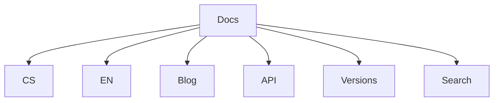

# Coherent MkDocs Pro

Produkční starter pro technickou dokumentaci.

## Hlavní části

- česká a anglická mutace
- fulltextové vyhledávání
- command palette
- blog
- verzování
- Mermaid diagramy
- OpenAPI sekce
- edit odkazy
- dark-first vzhled

## Rychlý start

```bash
python scripts/generate_indexes.py
mkdocs serve
```

## Architektura


