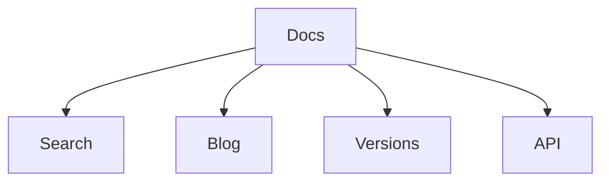

# MkDocs MaterialX Pro

Production starter pro moderní dokumentaci.

## Co je uvnitř

- CZ / EN
- search
- command palette
- blog
- versioning
- Mermaid
- OpenAPI
- edit links
- dark-first styling
- generated indexy

## Rychlý start

```bash
python scripts/generate_indexes.py
mkdocs serve
```

## Diagram


