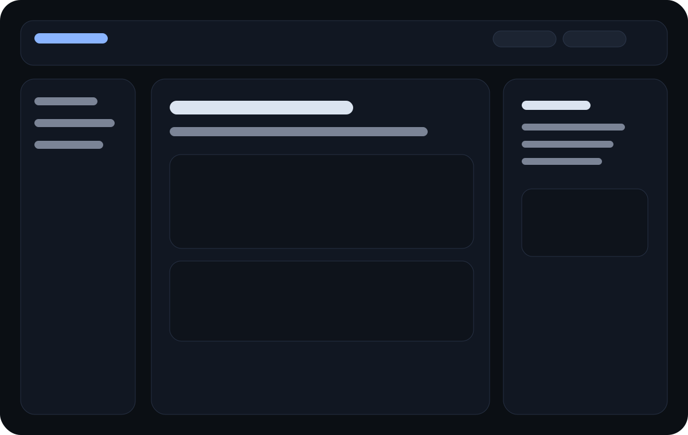

# VCCSD Docs

<div class="markup-hero">
  <div class="markup-hero__eyebrow">Dark shadcn-inspired release / bilingual shell / code-first UX</div>

  <div data-lang="cs">
    <p>Minimalistický dokumentační základ s čistším code block boxem, plynulejším skrollem a výrazně klidnějším vizuálním stylem.</p>
  </div>

  <div data-lang="en">
    <p>A minimalist documentation base with a sharper code block box, smoother scrolling, and a calmer visual identity.</p>
  </div>

  <div class="markup-hero__actions">
    <a class="primary" href="getting-started/">Rychlý start</a>
    <a href="code-blocks/">Code blocks</a>
    <a href="language-toggle/">Language toggle</a>
  </div>
</div>

## Mockup / wireframe

<a class="wireframe-frame glightbox" href="assets/wireframe-home.svg" data-type="image" aria-label="Open homepage wireframe">
  
</a>

## What is ready

- left navigation, top bar and TOC panel
- syntax highlighting for code samples
- language switcher with persistence
- skeleton loading shell
- lazy-reveal motion for content blocks
- GitHub Pages workflow

## Product cards

<div class="skeleton-grid">
  <section class="feature-card">
    <h3>Typography</h3>
    <p>Inter for prose and JetBrains Mono for code.</p>
  </section>
  <section class="feature-card">
    <h3>Code blocks</h3>
    <p>Toolbar, wrap, copy, language badge and stronger borders.</p>
  </section>
  <section class="feature-card">
    <h3>Language shell</h3>
    <p>CZ and EN content can live in one repo and one navigation model.</p>
  </section>
  <section class="feature-card">
    <h3>Loading states</h3>
    <p>Skeletons preserve layout while the page settles.</p>
  </section>
</div>

## Quick sample

```ts
export function greet(name: string) {
  return `Hello, ${name}`
}
```
